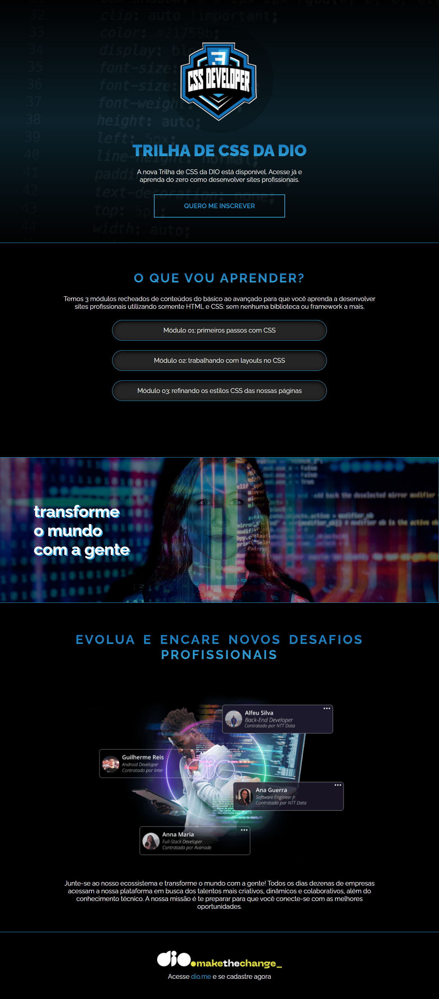

# 🚀 Projeto - Desafio Trilha de CSS | DIO.me  

    

---

## 📖 Sobre o Projeto  

Este projeto foi desenvolvido como parte da **Trilha de Estudos de CSS da DIO.me**.  
O desafio consistia em **estilizar uma landing page**, aplicando conceitos aprendidos em aula e no Figma.  

O **HTML já estava pronto** e o foco foi totalmente em **CSS**, explorando técnicas de:  
- Uso de gradientes e efeitos visuais 🎨  
- Aplicação de **tipografia moderna** com Google Fonts  
- **Layouts responsivos e flexíveis** usando Flexbox  
- Efeitos de **background com blend-mode e parallax**  
- Componentes estilizados como botões, listas de módulos e banners  

---

## 📸 Preview do Projeto  




---

## 🛠️ Tecnologias Utilizadas  

- **HTML5** → Estrutura já fornecida pela DIO  
- **CSS3** → Criação dos estilos e aplicação de boas práticas  
- **Google Fonts** → Tipografia "Raleway" para destacar o design  

---

## 📚 O que aprendi  

Durante o desafio, pratiquei:  
✔ Criar **componentes reutilizáveis** com CSS  
✔ Trabalhar com **gradientes e efeitos de texto**  
✔ Usar **flexbox para centralização e layouts responsivos**  
✔ Aplicar conceitos de **design system simples** no CSS  
✔ Melhorar a organização e legibilidade do código  

---

## 📂 Como visualizar o projeto  

1. Clone o repositório:  
   ```bash
   git clone https://github.com/seu-usuario/nome-do-repositorio.git

2. Acesse a pasta do projeto:
   ```bash
   cd nome-do-repositorio
